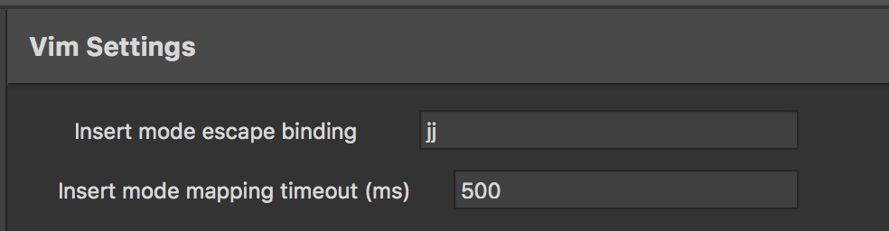

# XSVim [](https://gitter.im/XSVim/Lobby?utm_source=badge&utm_medium=badge&utm_campaign=pr-badge&utm_content=badge) [](https://travis-ci.org/nosami/XSVim)


# Installation

Interact with Visual Studio for Mac as follows:

```
Visual Studio -> Extensions -> Gallery -> IDE Extensions -> "VIM" -> Install
```

Then close the current document that you are working on and open a new document to activate the plugin.

# What works?

Most Vim commands should work. If you see something that doesn't work, please file an issue. There's a good chance that I just don't know about it.

# What doesn't work

- Vim split windows. XSVim uses VS for Mac's side by side mode to emulate this, but it's only possible to have 2 vertical split windows. `<C-w>s` and `<C-w>v` both switch to side by side mode.
- Visual block mode works for most tasks, but there are some differences in the way that VS handles virtual spacing at the end of lines.
- Selecting text with the mouse or using cmd+arrow keys doesn't switch to Visual mode
- No leader key support or configurable key bindings.

# Why don't the control keys work?

Some Vim keybindings (such as Ctrl-F, Ctrl-D etc) conflict with VS's own built in keybindings. However, there is a keybinding scheme included that you may apply if you want (Visual Studio + Vim)


# Extras

- `gd` - Goto declaration
- `gu` - Find usages
- `gb` - Go to base symbol
- `gh` - Show tooltip at current caret location (`G`o `H`over)
- `<C-p> - Go to file`
- `hjkl` support on the Solution Explorer pad and Test Explorer pad. Pressing `<esc>` on these will switch focus back to the last editor window.
- Goto Pad shortcuts start with `gp`
  - `gps` - Go to solution explorer 
  - `gpc` - Go to class pad
  - `gpe` - Go to error list pad
  - `gpt` - Go to Task List pad
  - `gpp` - Go to Property pad
  - `gpo` - Go to document outline pad
  - `gpb` - Go to breakpoint pad
  - `gpl` - Go to locals pad
  - `gpw` - Go to watch pad
  - `gpi` - Go to immediate pad
  - `gpn` - Go to F# Interactive pad
  - `gpf` - When there is only one search results pad, go to it
  - `gpf1` - When there is more than one search results pad, go to the 1st
  - `gpf2` - When there is more than one search results pad, go to the 2nd....etc.
  - `gpdt` - Go to debugger threads pad
  - `gpds` - Go to debugger stack trace pad
  - `gput` - Go to unit test pad
  - `gpur` - Go to unit test results pad
- Insert mode escape binding. See example screenshot to see how to configure `jj` to escape when in insert mode.


# Looking for the latest release?

Check the [release page](https://github.com/nosami/XSVim/releases) as there is usually a more recent version of the addin here than on the Visual Studio for Mac feed. Grab the .mpack file and install it via Visual Studio -> Extensions -> Install from file

# Support & Contributions

Jump in our [Gitter channel](https://gitter.im/XSVim/Lobby) and introduce yourself. 

# With thanks to

- @shirshov
- @mdizzy
- @tdfacer

